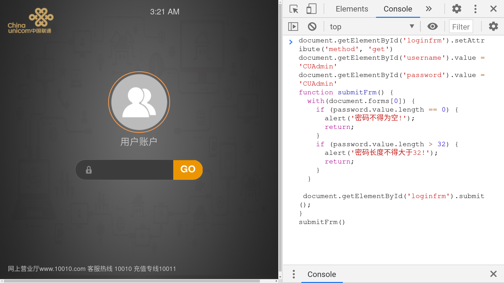

## 联通家庭 网关 TEWA-800E 管理员登录

在版本 `Tianyi_V3.1.2` 上测试，可以直接登入管理员后台。

进而可以修改连接模式，改为桥接等等。

直接在登录界面中按 F12 打开 DevTools，在 Console 中输入 `hack.js` 代码即可。

附，测试设备版本：

| 参数 | 值 |
| --------- | ------------------- |
| 设备类型: | EPON/4+1+WiFi(2.4G) |
| 运营商     | 中国联通            |
| 设备型号   | TEWA-800E           |
| 设备标识号 | *                   |
| 硬件版本   | V3.0                |
| 软件版本   | Tianyi_V3.1.2       |
| MAC/SN     | *                   |

